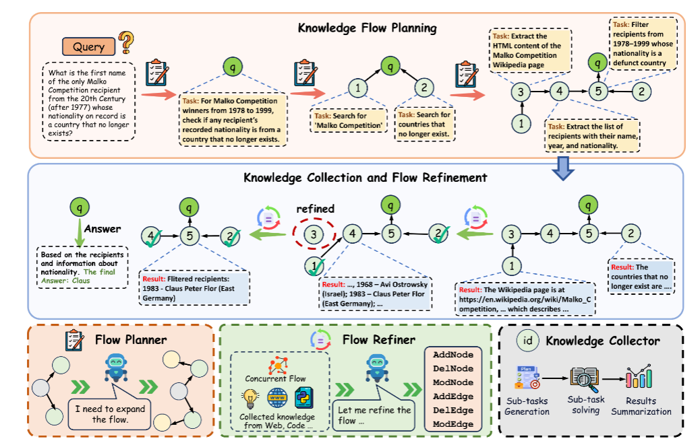

https://arxiv.org/pdf/2510.08521


## FlowSearch框架核心组件功能及协作机制
FlowSearch作为面向深度研究的多智能体框架，其核心优势源于**Knowledge Flow Planner（知识流规划器）**、**Knowledge Collector（知识收集器）** 和**Knowledge Flow Refiner（知识流优化器）** 三个组件的结构化设计与动态协作。三者围绕“动态结构化知识流”（以有向无环图G=(V,E)建模）展开，分别负责“规划流结构”“执行流节点”“优化流动态”，形成闭环迭代以支撑复杂研究任务。

## 一、三大核心组件的具体功能
### 1. Knowledge Flow Planner（知识流规划器）：构建初始知识流结构
该组件的核心目标是将模糊的用户研究需求（如“探索2025年多智能体AI科学家进展”）转化为**可执行、有依赖关系的结构化知识流**，避免传统线性流程的局限性。其具体功能包括：

#### （1）初始化与迭代扩展知识流
- **初始节点构建**：从用户查询（query）生成初始流$G_0^{init}$，仅包含一个“查询节点”（$v_{query}$），无依赖边（$E=\emptyset$）。
- **渐进式扩展**：通过训练后的LLM规划器（如论文中微调的InternPlanner），迭代分析当前流中节点的“信息缺口”，生成子任务节点（如“搜索多智能体AI科学家定义”“收集2025年代表性框架”）及依赖边。  
  数学化表达为：$G_{t+1}^{init}=f_{\theta}^{expand}(G_t^{init})$，其中$V_{t+1}^{init}=V_t^{init}\cup V_t^{add}$（新增节点）、$E_{t+1}^{init}=E_t^{init}\cup E_t^{add}$（新增依赖边），直至无新节点可添加，形成初始完整流$G_0=G_T^{init}$。

#### （2）节点与边的规范化定义
- 每个节点$v_i=(t_i,d_i,s_i,c_i)$：$t_i$（任务类型，如search/solve/answer）、$d_i$（任务描述）、$s_i$（执行状态，初始为“未执行”）、$c_i$（知识上下文，初始为空）；
- 每条边$e_{ij}=(v_i,v_j,r_{ij})$：$r_{ij}$（依赖关系，如“n3为n1提供信息”“n2为n1解决子问题”），明确节点间的逻辑顺序（如“先提取文献URL，再下载文献内容”）。

#### （3）训练与优化规划能力
- 基于10k条“知识流对话数据”微调LLM（如Qwen3系列）得到InternPlanner：数据格式为“输入当前流描述→输出扩展后流/终止信号”，确保规划器能精准识别子任务分解需求。

### 2. Knowledge Collector（知识收集器）：执行节点任务并填充知识
该组件是知识流的“执行层”，负责**处理流中可执行节点、调用工具获取信息、更新节点知识上下文**，为后续推理提供支撑。其具体功能包括：

#### （1）筛选可执行节点
- 识别“外层可执行节点”：即所有前驱节点（依赖节点）已完成执行的节点（如“若n2（提取URL）已完成，n3（下载URL内容）变为可执行”），避免依赖冲突。

#### （2）多智能体并行执行任务
- 为每个可执行节点分配“工具化LLM执行器”，根据节点类型（$t_i$）调用对应工具完成任务：
  - **search类节点**：调用网页搜索（如Wayback Machine归档页面）、文献下载、多媒体提取（图片/音频/视频）等工具；
  - **solve类节点**：调用OCR（图片文字提取）、代码执行（数据计算）、逻辑推理（如“从OCR文本中提取年份”）等工具；
  - **answer类节点**：整合所有依赖节点的$c_i$，生成最终答案或报告（如“综合n2-n7的知识，回答‘Carl Nebel维基引用图片的最新年份’”）。

#### （3）更新节点状态与知识上下文
- 执行后更新节点状态$s_i$：成功（标记为“已完成”）或失败（标记为“需重试”，如URL无法访问）；
- 成功节点的知识上下文$c_i$：将原始结果（如HTML内容、OCR文本、计算结果）提炼为结构化摘要（如“从OCR中提取的年份：1558,1577,...,1927”），作为后续依赖节点的输入。  
  数学化表达为：$s_i,c_i=f^{exec}(t_i,d_i|\{c_j|(v_j→v_i)∈E_t\})$，即执行结果依赖前驱节点的知识。

#### （4）工具集的多样性与安全性
- 支持20+类工具（见附录A）：包括网页归档搜索（search_archived_webpage）、多格式文档提取（extract_document_content）、多媒体问答（ask_question_about_image）、代码执行等，且工具实例独立化，避免状态冲突（如并行下载多个文件时互不干扰）。

### 3. Knowledge Flow Refiner（知识流优化器）：动态调整流结构
该组件是知识流的“自适应层”，基于**中间执行结果反馈，优化流的结构与逻辑**，解决“初始规划遗漏子任务”“部分节点冗余”等问题。其具体功能包括：

#### （1）分析执行反馈与知识缺口
- 基于Knowledge Collector的执行结果（节点$s_i$和$c_i$），识别流的优化需求：
  - 缺口：如“执行n3（下载文献）后发现文献需密码，需新增n4（搜索开放获取版本）”；
  - 冗余：如“n5（搜索‘2024年进展’）与用户需求‘2025年进展’无关，需删除”；
  - 错误依赖：如“n6（分析数据）依赖n4，但实际应依赖n5，需修改边方向”。

#### （2）执行六大图变换操作
通过LLM生成结构化变换指令，动态调整流$G_t$得到$G_{t+1}=f^{refine}(V_t,E_t)$：
| 操作类型       | 作用示例                                  |
|----------------|-------------------------------------------|
| AddNode        | 新增“搜索开放获取文献”节点n4              |
| DelNode        | 删除“2024年进展搜索”节点n5                |
| ModNode        | 将“提取所有年份”修改为“提取最新年份”      |
| AddEdge        | 新增“n4→n3”边（n4为n3提供开放URL）        |
| DelEdge        | 删除“n6→n4”边（n6不再依赖n4）             |
| ModEdge        | 将“n6→n4”修改为“n6→n5”（n6依赖n5数据）   |

#### （3）保障流的全局一致性
- 调整后需确保流仍为**有向无环图（DAG）**，避免循环依赖（如“n1依赖n2，n2依赖n1”）；同时保持“局部深度推理”与“全局逻辑连贯”的平衡（如“局部节点细化子任务，全局仍围绕用户查询推进”）。

## 二、三大组件的协作机制：闭环迭代推动深度研究
FlowSearch的核心流程是“规划→执行→优化”的**多轮闭环迭代**，直至用户查询节点（answer类）完成执行。具体协作步骤如下（结合图2与案例）：

### 1. 初始化阶段：Planner构建初始流
- **输入**：用户查询（如“研究2025年多智能体AI科学家进展”）；
- **Planner输出**：初始流$G_0$，包含核心节点（如task（answer）、n2（synthesize方法）、n3（search定义）、n4（summarize应用）等）及依赖边（如“n3→task”“n4→task”）；
- **协作点**：Planner将$G_0$传递给Collector，启动首次执行。

### 2. 执行-优化迭代阶段：Collector与Refiner动态协作
#### （1）第一轮迭代：执行初始可执行节点
- **Collector**：识别初始流中无依赖的节点（如n3（search定义）、n7（search挑战）），并行调用搜索工具获取信息，更新$c_3$（“多智能体AI科学家定义：协作完成科研全流程的MAS”）、$c_7$（“2025年挑战：agent协调复杂度”），标记$s_3=s_7=$“成功”；
- **Refiner**：分析$c_3$和$c_7$，发现“缺少2025年代表性框架数据”，执行AddNode新增n8（search 2025代表性框架），并添加边“n8→task”，生成更新流$G_1$。

#### （2）第二轮及后续迭代：持续执行与优化
- **Collector**：在$G_1$中，n8（无依赖）变为可执行，调用工具获取“Google AI Co-Scientist”“Stanford Virtual Lab”等案例，更新$c_8$；同时，n2（synthesize方法）的前驱节点n3已完成，开始执行n2，整合$c_3$生成“方法综述”；
- **Refiner**：分析$c_8$，发现“缺少框架性能数据”，新增n9（search框架benchmark结果）；同时删除冗余节点n5（原“2024年框架”），生成$G_2$；
- 重复上述步骤，直至所有非answer节点执行完成，仅剩余query节点（task）未执行。

### 3. 结论生成阶段：Collector整合知识输出结果
- **Collector**：针对query节点（answer类），根据任务类型选择总结模式：
  - 问答任务（如“Carl Nebel引用图片年份”）：仅整合依赖节点（n2-n7）的$c_i$，生成简洁答案（“1927”）；
  - 报告任务（如“2025年多智能体AI科学家进展”）：整合所有节点（n2-n9）的$c_i$，生成包含“定义-方法-案例-挑战”的完整报告；
- **最终输出**：用户需求对应的答案或报告，完成深度研究任务。

## 三、协作优势：解决传统研究框架的核心痛点
1. **突破线性流程局限**：通过DAG知识流支持并行执行（如同时搜索“定义”和“挑战”），效率提升30%-50%（论文案例中报告生成仅需10分钟）；
2. **动态适应研究需求**：Refiner的实时调整避免“初始规划僵化”（如新增benchmark节点补充数据缺口），相比静态 pipeline 任务完成率提升25%+；
3. **保障推理连贯性**：节点间的依赖边明确逻辑关系（如“先OCR再提取年份”），减少传统多智能体的“上下文溢出”问题，GAIA基准准确率达76.96%（超OWL等框架10%+）。

综上，FlowSearch的三大组件通过“规划定结构、执行填知识、优化调动态”的闭环协作，实现了“广度探索”与“深度推理”的平衡，为跨学科深度研究（如生物医药、材料科学）提供了高效的智能框架。