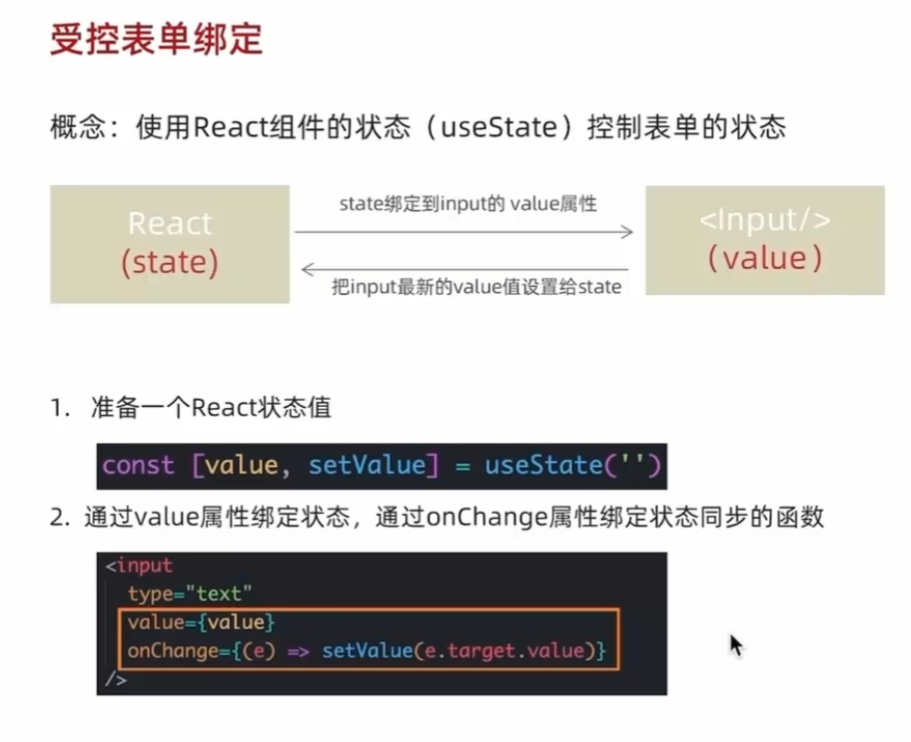



## react事件绑定

on +  事件名称 = { 事件处理程序 }
```tsx
const clickHandler = () => {}
return (
	<button onClick={clickHandler}></button>
)
```
事件参数e的传入
```tsx
const clickHandler = (e,name) => {}
return (
	<button onClick={(e) => clickHandler(e,"jack")}></button>
)
```

## useState
创建状态变量
```tsx
count [count,setCount] = useState(0)
```
count 状态变量
setCount 修改状态变量的方法


```tsx
const handleClick = () => {
	setCount(count+1)
}
```
修改count
使用新count渲染UI

```tsx
<button onClick={handleClick}>{count}</button>
```

修改对象状态
```tsx
const [form,setForm] = useState({ name: 'jack'})
```
setForm传入全新的完整对象
```tsx
const = changeForm = () => {
	setForm({
		...form,
		name:"john"
	})
}
```

## 受控表单绑定

## useRef获取DOM 
1. useRef创建ref对象，并与JSX绑定
```tsx
const inputRef = useRef(null)
<input type="text" ref={inputRef} />
```
2. 在DOM可用时，通过inputRef.current拿到DOM对象

## 组件通信

### 父子通信

实现步骤：
1. 父组件传数据 - 在子组件标签上绑定属性
```tsx
//父组件
return (
	<div>
		<Son name={name} />
	</div>
)
```
2. 子组件接收数据 - 子组件通过props参数接收数据
```tsx
function Son (props){
	return <div>this is son, {props.name}</div>
}
```

**props说明**：


**prop children**
当我们把内容嵌套在子组件标签中时，子组件会自动在名为children的prop属性中接收该内容
 ```tsx
 <Son>
	 <span>this is span</span>
 </Son>
 ```
 子组件接收props时会有children传入`<span />`
 

### 兄弟通信
### 跨层通信