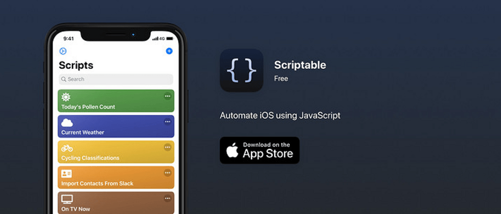
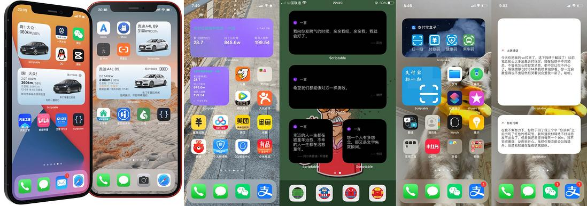
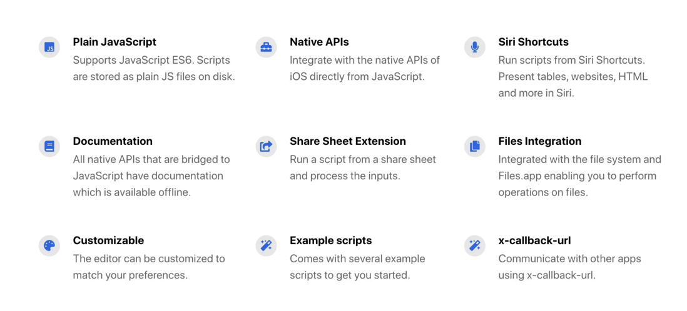
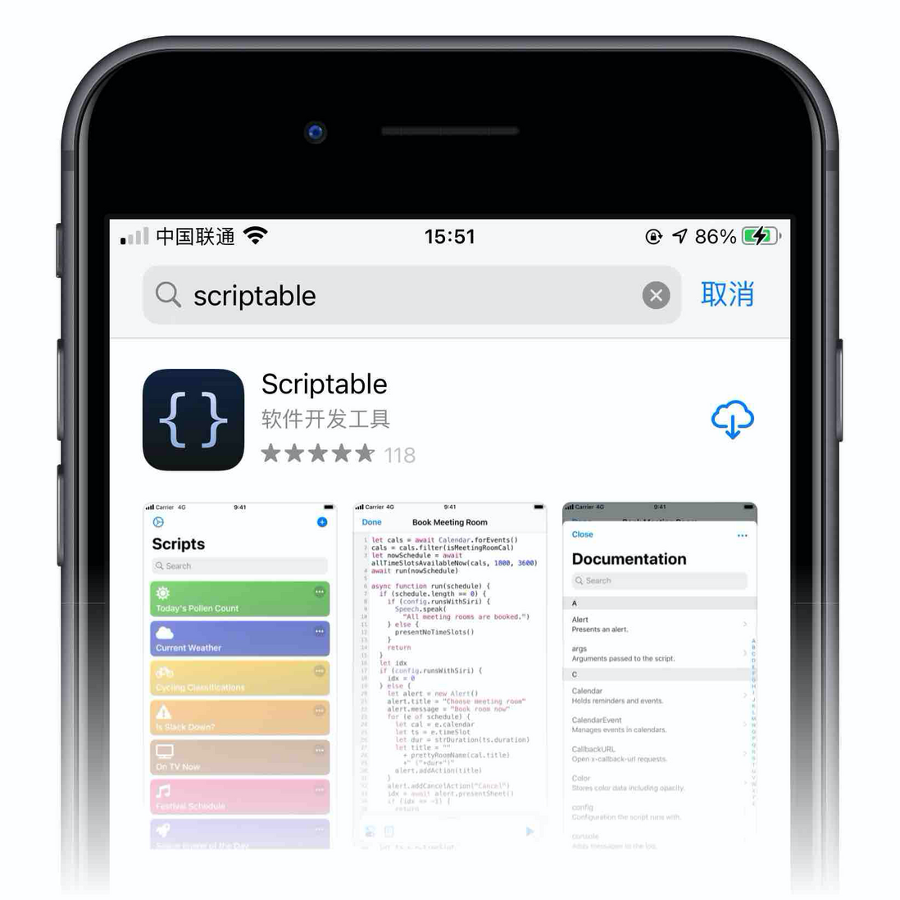
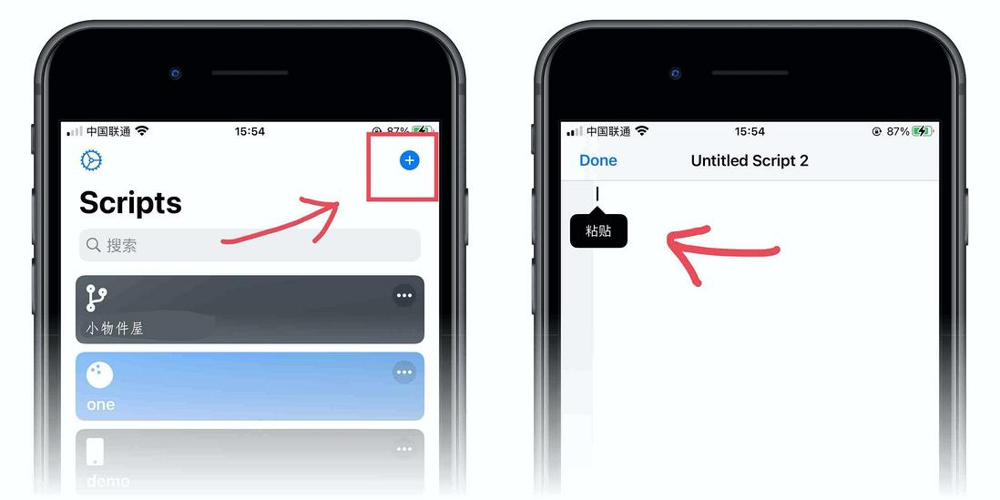
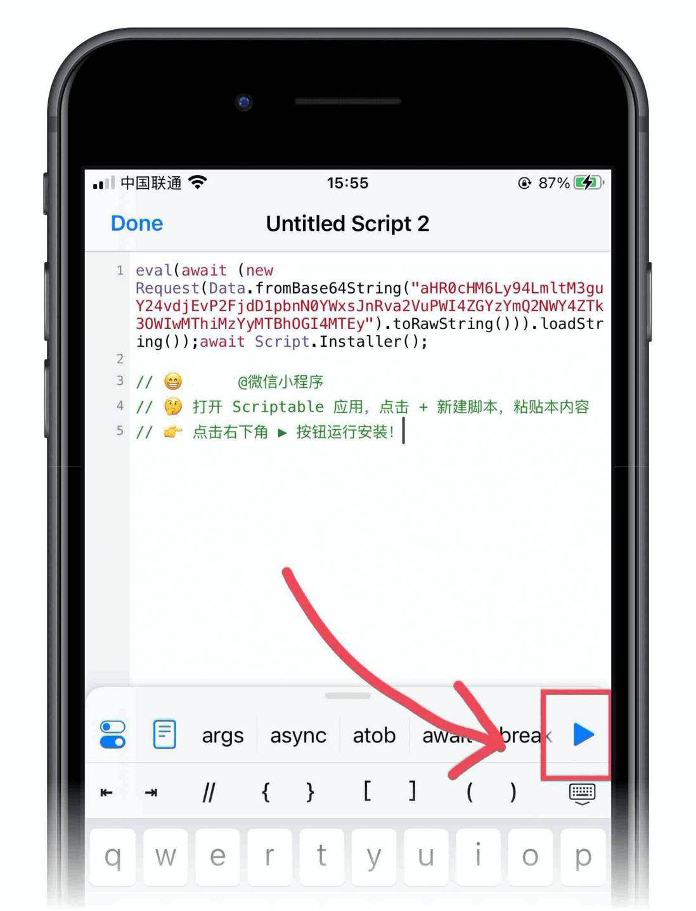
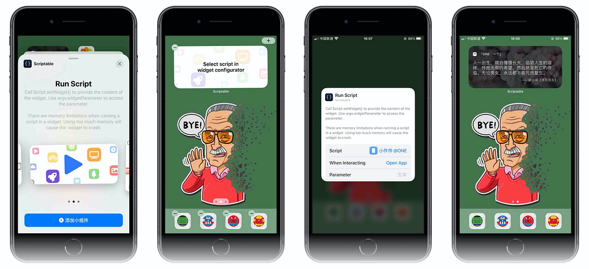




### 前言

ios用户当更新到iOS14后，我们的iPhone等ios设备支持我们用户自定义桌面小物件（又或者称之为小组件、桌面挂件），利用这个特性，网上出现了许许多多诸如透明时钟、微博热搜、知乎热榜、网易云热评、特斯拉、BMW、名爵、奥迪等等的iPhone桌面，看如下实际效果图：



那这到底是怎么实现的，我们怎么才能制作一款自己的iPhone个性桌面？今天给大家分享的就是Scriptable的桌面玩法，对于javascript开发人员来说，看完这篇教程，上手小物件开发应用是信手拈来的事儿，而对于没有编程基础的同学不用担心看不懂，你所要做的就是复制粘贴，直接跳过开发教程，看文章末尾快速通道即可。

### Scriptable介绍

> 这是一款可让您使用 JavaScript 自动化构建 iOS 的应用程序

以上是对Scriptable的官方解释，这对前端开发者来说无疑是一个福音，因为Scriptable 使用 Apple 的[JavaScriptCore](https://link.segmentfault.com/?enc=%2FUCMPIoYyMA5HHopY27tIw%3D%3D.Z4f2gckcedBbIODwk46TokXHn06tmxnmlhGkrTbcx9CB5KuODU1spkx%2BKVD6UmVeApGGDeFS7FfeN2LtNtKIlA%3D%3D)，它默认就支持[ECMAScript 6](https://link.segmentfault.com/?enc=TX%2BymuepfAV8LjnM10eP%2FA%3D%3D.Zxf0s4I4z0lHKGLNJH6Jmdo22aj3g5n4t436TA0bWB97NahbwKDxV6H0OKAZGwKo)对小组件进行开发构建。

如果您刚刚开始使用 JavaScript，您可能想看看 Codecademys [Intro to Programming in JavaScript](https://link.segmentfault.com/?enc=2Fz%2FqRRnA8uFBGpBj0187w%3D%3D.%2Bgz1Xz4zyiRc5ae2aO88QqXJHaZl3jCeNT8%2B4%2BHlPhmSO2lY1%2F4sKdbX1CWYP0smW9Y5jtesObw1DHE92JnK7kpi35ofv8yqGCGZrVf5FNI%3D)。有关 JavaScript 功能的快速参考，您可以参考 W3Schools 的[JavaScript 教程](https://link.segmentfault.com/?enc=05ZUoK31xMMvRG6Crx6%2BLA%3D%3D.dIHTKgQB%2BIuPGj2CH15WlzxfMK55CytoPPrJdaL3SLxJOsEL8c9qZYPlOccy2hFe)。

请注意，一些指南和教程会假设您在浏览器中运行 JavaScript，因此可以访问特定于浏览器的对象，例如文档。Scriptable 不在浏览器中运行 JavaScript，因此不存在此类对象。

更多对于Scriptable的解释请阅读[官方文档](https://link.segmentfault.com/?enc=W0H5U5OJNdFbrrzTyKkz2w%3D%3D.vb9Ei2mKMvbqdfV5gaXSsO17B3aVuUNyqtZGGyJlfdY%3D)

### 关键特性

先看一张图：



上面列举的是一些**Scriptable**的特性，这些特性包括：

- **支持ES6语法**
- **可以使用JavaScript调用一些原生的API**
- **Siri 快捷方式**
- **完善的文档支持**
- **共享表格扩展**
- **文件系统继承**
- **编辑器的自定义**
- **代码样例**
- **以及通过x-callback-url和其它APP交互**

是不是感觉支持的特性还是挺多的，这些特性已经足够让我们去实现很多原生级底层的交互了。

### 第一个小物件程序

```javascript
// 判断是否是运行在桌面的组件中
if (config.runsInWidget) {
  // 创建一个显示元素列表的小部件
  // 显示元素列表的小部件。将小部件传递给 Script.setWidget() 将其显示在您的主屏幕上。
  // 请注意，小部件会定期刷新，小部件刷新的速率很大程度上取决于操作系统。
  // 另请注意，在小部件中运行脚本时存在内存限制。当使用太多内存时，小部件将崩溃并且无法正确呈现。
  const widget = new ListWidget();
  // 添加文本物件
  const text = widget.addText("Hello, World!");
  // 设置字体颜色
  text.textColor = new Color("#000000");
  // 设置字体大小
  text.font = Font.boldSystemFont(36);
  // 设置文字对齐方式
  text.centerAlignText();
  // 新建线性渐变物件
  const gradient = new LinearGradient();
  // 每种颜色的位置,每个位置应该是 0 到 1 范围内的值，并指示渐变colors数组中每种颜色的位置
  gradient.locations = [0, 1];
  // 渐变的颜色。locations颜色数组应包含与渐变属性相同数量的元素。
  gradient.colors = [new Color("#F5DB1A"), new Color("#F3B626")];
  // 把设置好的渐变色配置给显示元素列表的小部件背景
  widget.backgroundGradient = gradient;
  // 设置部件
  Script.setWidget(widget);
}
```

通过以上简单的显示"Hello, World!"并设置背景色和文字样式的程序来看，有一个重要的概念需要javascript程序员去理解和从传统的web开发的概念中转换过来，如果你之前有开发过[`Flutter`](https://link.segmentfault.com/?enc=voVB2v%2BJIBvaUd4jz0MVtw%3D%3D.4Dwq%2Fu3u6pYwV03fMfntpwl80FT0%2Fpps6aLipIMm0GA7HFnUU%2F8SeLhxlha1Bzbv)开发经验的话，那么对你来说，开发Scriptable应用应该是有共鸣的。因为对于我看来，Scriptable同样也是万物皆组件（widget）的概念，支撑这一点的一个重要思想就是面向对象。

### 万物皆组件

何为万物皆组件？无论是容器（div）还是样式（color、style）还是元素（font）等等全是Object，比如你要显示一行文字"Hello, World!"，那么你首先必须要有一个容器（div）去装载这行文字（fonts），你还要去给文字设置样式（styles），那样式也不是说凭空生成，凡是对象，都要new出来。对照以上"Hello, World!"的例子再深入理解这个概念。

以上概念对Scriptable应用开发有极其重要的积极作用，尤其是对于初级前端开发者或没有原生app开发经验的开发者来说，他们很难脱离传统web这种mvvc或者mvc的开发模式去思考面向对象的开发模式。

### 高频常用的组件

#### ListWidge

显示元素列表的小部件，最常用的容器组件。一般组件应用的根元素都用ListWidget包裹，也只有用这个组件才能传递给 Script.setWidget() 将其显示在您的主屏幕上。

请注意，小部件会定期刷新，并且小部件刷新的速率很大程度上取决于操作系统。注意：利用这一点可以做很多需要基于定时刷新的应用，比如：节日纪念日，需要计算当前时间的应用。

另请注意，在小部件中运行脚本时存在内存限制。当使用太多内存时，小部件将崩溃并且无法正确呈现。

##### -addStack

`addStack(): WidgetStack`

添加堆栈。

`ListWidget.addStack()`返回值是`WidgetStack`（堆栈元素），将堆栈元素添加到ListWidget中是水平布局的，可以利用这个`api`实现类似于`flex`布局

##### -addSpacer

`addSpacer(length: number): WidgetSpacer`

向小部件添加间隔。这可用于在小部件中垂直偏移内容。类似于web开发中css的`margin`

##### -setPadding

`setPadding(top: number, leading: number, bottom: number, trailing: number)`

设置小部件每一侧的填充。类似web中css的`padding`

##### -addText

`addText(text: string): WidgetText`

将文本元素添加到小部件。使用返回元素的属性来设置文本样式。类比web开发中的向div中插入文本节点。

##### backgroundColor

`backgroundColor: Color`

设置容器的背景颜色，值必须是Color类型（`new Color('#fff', 1)`），Color构造函数的第一个参数为色值，第二个参数为透明度，类似web开发中的rgba(255,255,255,1)

##### backgroundImage

`backgroundImage: Image`

设置容器的背景图片。类似web中css的`backgroud-image`

#### Font

表示字体和文本大小。

`new Font(name: string, size: number)`

该字体可用于设置文本样式，例如在小部件中。

##### - regularSystemFont

创建常规系统字体。

`static regularSystemFont(size: number): Font`

##### -lightSystemFont

创建白天模式系统字体。

`static lightSystemFont(size: number): Font`

##### -thinSystemFont

创建细系统字体。

`static thinSystemFont(size: number): Font`

#### Keychain

钥匙串是凭据、密钥等的安全存储。使用该`set()`方法将值添加到钥匙串。然后，您可以稍后使用该`get()`方法检索该值。

##### -contains

检查钥匙串是否包含钥匙。

`static contains(key: string): bool`

检查钥匙串是否包含指定的钥匙。

##### -set

将指定键的值添加到钥匙串。

`static set(key: string, value: string)`

将值添加到钥匙串，将其分配给指定的键。如果密钥已存在于钥匙串中，则该值将被覆盖。

值安全地存储在加密数据库中。

##### -get

从钥匙串中读取一个值。

`static get(key: string): string`

读取指定键的值。如果密钥不存在，该方法将引发错误。使用该`contains`方法检查钥匙串中是否存在钥匙。

#### Alert

显示模态弹窗。类似web ui中的Modal组件

使用它来配置以模态或表单形式呈现的弹窗。配置弹窗后，调用 presentAlert() 或 presentSheet() 以呈现弹窗。这两种表示方法将返回一个值，该值携带完成时选择的操作的索引。比如你弹窗添加了两个操作按钮，先添加一个是`确定`，另一个是`取消`按钮，添加操作跟js中的数组一致，先添加的按钮索引就是 0，当用户点击`确认`按钮的时候，`alert.presentAlert()`返回的值就是'确认'在配置数组中的索引值，即为0。

个人认为这个组件也是非常高频的组件，因为在高级桌面组件或者复杂的组件，尤其是一些需要用户登录账号信息的桌面组件来说，需要弹窗让用户输入账号密码等交互行为，又或者让用户输入日期、名称等需要持久化存储的场景，Alert组件是不二之选。

##### -message

`title: string`

弹窗中显示的标题。通常是一个短字符串。

##### -addAction

向弹窗中添加操作按钮。要检查是否选择了某个操作，您应该使用在 presentAlert() 和 presentSheet() 返回的`Promise`时提供的第一个参数。

```javascript
// 创建一个弹窗组件
let alert = new Alert();
// 设置弹窗中显示的content
alert.message = '弹窗中显示的内容，这里可以展示对操作的解释等文案信息...';
// 向弹窗中加入一个按钮-确定，索引为0
alert.addAction('确定');
// 向弹窗中加入一个按钮-取消，所以为1
alert.addAction('取消');
// 获取弹窗按钮被触发后拿到用户点击的具体某个按钮索引，如果点击确定，response === 0 否则 response === 1
let response = await alert.presentAlert();
```

##### -addCancelAction

`addCancelAction(title: string)`

向弹窗中添加取消操作。选择取消操作时，kidealert（）或vistentheet（）提供的索引将始终为-1。请注意，在 iPad 上运行并使用 presentSheet() 进行演示时，该操作不会显示在操作列表中。通过在工作表外点击可取消操作。

弹窗只能包含一个取消操作。尝试添加更多取消操作将删除之前添加的任何取消操作。

##### -presentAlert

显示模态弹出窗，类似`elementui`中`modal`的`visible`设置为`true`，此时弹窗显示。

##### -presentSheet

将弹窗以类似bottomSheet交互方式弹出。

#### Image

管理图像数据。

图像对象包含图像数据。Scriptable 中处理图像的 API（通过将图像作为输入或返回图像）将使用此 Image 类型。

##### -size

`size: Size`

图像的大小（以像素为单位）。只读

##### -fromFile

从指定的文件路径加载图像。如果无法读取图像，该函数将返回 null。类似web开发中读取本地（ios中还有iCloud）图片文件

##### -fromData

`static fromData(data: Data): Image`

从原始数据加载图像。如果无法读取图像，该函数将返回 null。

Data可以是字符串、文件和图像的原始数据表示。例如，Image中用的比较多的就是从base64字符串中读取图片，伪代码示例如下：

```javascript
let imageDataString = 'base64:xxxxx'
let imageData = Data.fromBase64String(imageDataString)
// Convert to image and crop before returning.
let imageFromData = Image.fromData(imageData)
// return Image(imageFromData)
return imageFromData
```

更多关于Data的其他api[请参考文档](https://link.segmentfault.com/?enc=RzfSShBZdKbstjIwvOFkEg%3D%3D.O8Iyi08TElEtL6ZZWaAtaywLtAH935BJtSCl3K6qkm2PPG712gTaNLKTulTLbY5l)

#### Photos

提供对您的照片库的访问。

为了从您的照片库中读取，您必须授予应用程序访问您的照片库的权限。首次使用 API 时，应用会提示访问，但如果您拒绝请求，所有 API 调用都会失败。在这种情况下，您必须从系统设置中启用对照片库的访问。

这个api用的也是相对高频的一个，因为大部分场景下，你的widget都需要用到图片或者背景，而使用图片的大部分场景（特别是背景图）都需要访问你的设备图库，也就是你的相册，当然使用相册功能必须在用户授权的前提下。

##### -fromLibrary

`static fromLibrary(): Promise<Image>`

显示用于选择图像的照片库，使用它从照片库中挑选图像。

使用它:

```javascript
const img = await Photos.fromLibrary();
// 拿到Image对象后，可以对它做缓存、展示、传输等等用途
```

##### -latestPhoto

获取最新照片。

`static latestPhoto(): Promise<Image>`

从您的照片库中读取最新照片。如果没有可用的照片，则承诺将被拒绝。

##### -latestScreenshot

获取最新截图。

`static latestScreenshot(): Promise<Image>`

从您的照片库中读取最新的屏幕截图。如果没有可用的屏幕截图，则 Promise 将被拒绝。

#### Pasteboard

复制并粘贴字符串或图像。

从粘贴板复制和粘贴字符串和图像。

##### -copy

将字符串复制到粘贴板。

`static copy(string: string)`

##### -paste

从粘贴板粘贴字符串。

`static paste(): string`

##### -copyImage

将图像复制到粘贴板。

`static copyImage(image: Image)`

#### LinearGradient

线性渐变。

要在小部件中使用的线性渐变。

##### -colors

渐变的颜色。

`locations`颜色数组应包含与渐变属性相同数量的元素。

`colors: [Color]`

类似css中`linear-gradient`属性的第二、三个从参数，表示渐变的颜色范围

```css
.horizontal-gradient {
  background: linear-gradient(to right, blue, pink);
}
```

##### -locations

每种颜色的位置。

每个位置应该是 0 到 1 范围内的值，并指示渐变`colors`数组中每种颜色的位置。

`colors`位置数组应包含与渐变属性相同数量的元素。

`locations: [number]`

```javascript
const bg = new LinearGradient()
bg.locations = [0, 1]
bg.colors = [
  new Color('#f35942', 1),
  new Color('#e92d1d', 1)
]
w.backgroundGradient = bg
```

#### FileManager

此api适用于做缓存数据用，比较常用的api之一，使用频次较高

##### -local

创建一个本地 FileManager。

`static local(): FileManager`

创建一个文件管理器，用于操作本地存储的文件。

```javascript
const files = FileManager.local();
```

##### -iCloud

创建一个 iCloud 文件管理器。

`static iCloud(): FileManager`

创建一个文件管理器，用于操作存储在 iCloud 中的文件。必须在设备上启用 iCloud 才能使用它。

##### -read

将文件的内容作为数据读取。

`read(filePath: string): Data`

读取文件路径指定的文件内容作为原始数据。要将文件作为字符串`readString(filePath)`读取，请参见并将其作为图像读取，请参见`readImage(filePath)`.

如果文件不存在或存在于 iCloud 但尚未下载，该函数将出错。用于`fileExists(filePath)`检查文件是否存在并`downloadFileFromiCloud(filePath)`下载文件。请注意，调用 始终是安全的`downloadFileFromiCloud(filePath)`，即使文件本地存储在设备上。

##### -readImage

将文件的内容作为图像读取。

`readImage(filePath: string): Image`

读取文件路径指定的文件内容并将其转换为图像。

```javascript
// 读取自己在本地缓存的图片
const img = files.readImage(files.joinPath(files.documentsDirectory(), "avatar.jpg"))
```

##### -write

将数据写入文件。

`write(filePath: string, content: Data)`

##### -writeImage

将图像写入文件。

`writeImage(filePath: string, image: Image)`

将图像写入磁盘上的指定文件路径。如果该文件尚不存在，则会创建该文件。如果文件已经存在，则文件的内容将被新内容覆盖。

##### -fileExists

检查文件是否存在。

`fileExists(filePath: string): bool`

检查文件是否存在于指定的文件路径中。在移动或复制到目标之前检查这一点可能是一个好主意，因为这些操作将替换目标文件路径中的任何现有文件。

##### -documentsDirectory

文档目录的路径。

`documentsDirectory(): string`

用于检索文档目录的路径。**您的脚本存储在此目录中**。如果您启用了 iCloud，您的脚本将存储在 iCloud 的文档目录中，否则它们将存储在本地文档目录中。该目录可用于长期存储。可以使用“文件”应用程序访问存储在此目录中的文档。存储在本地文档目录中的文件不会出现在“文件”应用程序中。

##### -joinPath

连接两个路径组件。功能同`node`中的`joinPath`

`joinPath(lhsPath: string, rhsPath: string): string`

连接两条路径以创建一条路径。例如，用文件名连接到目录的路径。这是创建传递给 FileManager 的读取和写入函数的新文件路径的建议方法。

### 封装常用方法

#### 网络请求

```javascript
/**
   * HTTP 请求接口
   * @param {string} url 请求的url
   * @param {bool} json 返回数据是否为 json，默认 true
   * @param {bool} useCache 是否采用离线缓存（请求失败后获取上一次结果），
   * @return {string | json | null}
*/
async httpGet(url, json = true, useCache = false) {
  let data = null
  const cacheKey = this.md5(url)
  if (useCache && Keychain.contains(cacheKey)) {
    let cache = Keychain.get(cacheKey)
    return json ? JSON.parse(cache) : cache
  }
  try {
    let req = new Request(url)
    data = await (json ? req.loadJSON() : req.loadString())
  } catch (e) {}
  // 判断数据是否为空（加载失败）
  if (!data && Keychain.contains(cacheKey)) {
    // 判断是否有缓存
    let cache = Keychain.get(cacheKey)
    return json ? JSON.parse(cache) : cache
  }
  // 存储缓存
  Keychain.set(cacheKey, json ? JSON.stringify(data) : data)
  return data
}
```

#### 获取远程图片

```javascript
/**
   * 获取远程图片内容
   * @param {string} url 图片地址
   * @param {bool} useCache 是否使用缓存（请求失败时获取本地缓存）
*/
async getImageByUrl(url, useCache = true) {
  const cacheKey = this.md5(url)
  const cacheFile = FileManager.local().joinPath(FileManager.local().temporaryDirectory(), cacheKey)
  // 判断是否有缓存
  if (useCache && FileManager.local().fileExists(cacheFile)) {
    return Image.fromFile(cacheFile)
  }
  try {
    const req = new Request(url)
    const img = await req.loadImage()
    // 存储到缓存
    FileManager.local().writeImage(cacheFile, img)
    return img
  } catch (e) {
    // 没有缓存+失败情况下，返回自定义的绘制图片（红色背景）
    throw new Error('加载图片失败');
  }
}
```

#### 带透明度的背景图

```javascript
async function shadowImage(img) {
  let ctx = new DrawContext()
  // 把画布的尺寸设置成图片的尺寸
  ctx.size = img.size
  // 把图片绘制到画布中
  ctx.drawImageInRect(img, new Rect(0, 0, img.size['width'], img.size['height']))
  // 设置绘制的图层颜色，为半透明的黑色
  ctx.setFillColor(new Color('#000000', 0.5))
  // 绘制图层
  ctx.fillRect(new Rect(0, 0, img.size['width'], img.size['height']))

  // 导出最终图片
  return await ctx.getImage()
}
```

#### 获取时间差

```javascript
function getDistanceSpecifiedTime(dateTime) {
  // 指定日期和时间
  var EndTime = new Date(dateTime);
  // 当前系统时间
  var NowTime = new Date();
  var t = EndTime.getTime() - NowTime.getTime();
  var d = Math.floor(t / 1000 / 60 / 60 / 24);
  var h = Math.floor(t / 1000 / 60 / 60 % 24);
  var m = Math.floor(t / 1000 / 60 % 60);
  var s = Math.floor(t / 1000 % 60);
  return d;
}
```

#### 所有支持的手机小物件像素大小和位置

常用来设置伪透明背景

```javascript
// Pixel sizes and positions for widgets on all supported phones.
function phoneSizes() {
  let phones = {
    // 12 and 12 Pro
    "2532": {
      small:  474,
      medium: 1014,
      large:  1062,
      left:  78,
      right: 618,
      top:    231,
      middle: 819,
      bottom: 1407
    },

    // 11 Pro Max, XS Max
    "2688": {
      small:  507,
      medium: 1080,
      large:  1137,
      left:  81,
      right: 654,
      top:    228,
      middle: 858,
      bottom: 1488
    },

    // 11, XR
    "1792": {
      small:  338,
      medium: 720,
      large:  758,
      left:  54,
      right: 436,
      top:    160,
      middle: 580,
      bottom: 1000
    },


    // 11 Pro, XS, X
    "2436": {
      small:  465,
      medium: 987,
      large:  1035,
      left:  69,
      right: 591,
      top:    213,
      middle: 783,
      bottom: 1353
    },

    // Plus phones
    "2208": {
      small:  471,
      medium: 1044,
      large:  1071,
      left:  99,
      right: 672,
      top:    114,
      middle: 696,
      bottom: 1278
    },

    // SE2 and 6/6S/7/8
    "1334": {
      small:  296,
      medium: 642,
      large:  648,
      left:  54,
      right: 400,
      top:    60,
      middle: 412,
      bottom: 764
    },


    // SE1
    "1136": {
      small:  282,
      medium: 584,
      large:  622,
      left: 30,
      right: 332,
      top:  59,
      middle: 399,
      bottom: 399
    },

    // 11 and XR in Display Zoom mode
    "1624": {
      small: 310,
      medium: 658,
      large: 690,
      left: 46,
      right: 394,
      top: 142,
      middle: 522,
      bottom: 902 
    },

    // Plus in Display Zoom mode
    "2001" : {
      small: 444,
      medium: 963,
      large: 972,
      left: 81,
      right: 600,
      top: 90,
      middle: 618,
      bottom: 1146
    }
  }
  return phones
}
```

#### 获取截图中的组件剪裁图

```javascript
/**
   * 获取截图中的组件剪裁图
   * 可用作透明背景
   * 返回图片image对象
   * 代码改自：https://gist.github.com/mzeryck/3a97ccd1e059b3afa3c6666d27a496c9
   * @param {string} title 开始处理前提示用户截图的信息，可选（适合用在组件自定义透明背景时提示）
*/
async getWidgetScreenShot (title = null) {
  // Generate an alert with the provided array of options.
  async function generateAlert(message,options) {

    let alert = new Alert()
    alert.message = message

    for (const option of options) {
      alert.addAction(option)
    }

    let response = await alert.presentAlert()
    return response
  }

  // Crop an image into the specified rect.
  function cropImage(img,rect) {

    let draw = new DrawContext()
    draw.size = new Size(rect.width, rect.height)

    draw.drawImageAtPoint(img,new Point(-rect.x, -rect.y))  
    return draw.getImage()
  }

  async function blurImage(img,style) {
    const blur = 150
    const js = `
var mul_table=[512,512,456,512,328,456,335,512,405,328,271,456,388,335,292,512,454,405,364,328,298,271,496,456,420,388,360,335,312,292,273,512,482,454,428,405,383,364,345,328,312,298,284,271,259,496,475,456,437,420,404,388,374,360,347,335,323,312,302,292,282,273,265,512,497,482,468,454,441,428,417,405,394,383,373,364,354,345,337,328,320,312,305,298,291,284,278,271,265,259,507,496,485,475,465,456,446,437,428,420,412,404,396,388,381,374,367,360,354,347,341,335,329,323,318,312,307,302,297,292,287,282,278,273,269,265,261,512,505,497,489,482,475,468,461,454,447,441,435,428,422,417,411,405,399,394,389,383,378,373,368,364,359,354,350,345,341,337,332,328,324,320,316,312,309,305,301,298,294,291,287,284,281,278,274,271,268,265,262,259,257,507,501,496,491,485,480,475,470,465,460,456,451,446,442,437,433,428,424,420,416,412,408,404,400,396,392,388,385,381,377,374,370,367,363,360,357,354,350,347,344,341,338,335,332,329,326,323,320,318,315,312,310,307,304,302,299,297,294,292,289,287,285,282,280,278,275,273,271,269,267,265,263,261,259];var shg_table=[9,11,12,13,13,14,14,15,15,15,15,16,16,16,16,17,17,17,17,17,17,17,18,18,18,18,18,18,18,18,18,19,19,19,19,19,19,19,19,19,19,19,19,19,19,20,20,20,20,20,20,20,20,20,20,20,20,20,20,20,20,20,20,21,21,21,21,21,21,21,21,21,21,21,21,21,21,21,21,21,21,21,21,21,21,21,21,21,21,21,22,22,22,22,22,22,22,22,22,22,22,22,22,22,22,22,22,22,22,22,22,22,22,22,22,22,22,22,22,22,22,22,22,22,22,22,22,23,23,23,23,23,23,23,23,23,23,23,23,23,23,23,23,23,23,23,23,23,23,23,23,23,23,23,23,23,23,23,23,23,23,23,23,23,23,23,23,23,23,23,23,23,23,23,23,23,23,23,23,23,23,24,24,24,24,24,24,24,24,24,24,24,24,24,24,24,24,24,24,24,24,24,24,24,24,24,24,24,24,24,24,24,24,24,24,24,24,24,24,24,24,24,24,24,24,24,24,24,24,24,24,24,24,24,24,24,24,24,24,24,24,24,24,24,24,24,24,24,24,24,24,24,24,24,24];function stackBlurCanvasRGB(id,top_x,top_y,width,height,radius){if(isNaN(radius)||radius<1)return;radius|=0;var canvas=document.getElementById(id);var context=canvas.getContext("2d");var imageData;try{try{imageData=context.getImageData(top_x,top_y,width,height)}catch(e){try{netscape.security.PrivilegeManager.enablePrivilege("UniversalBrowserRead");imageData=context.getImageData(top_x,top_y,width,height)}catch(e){alert("Cannot access local image");throw new Error("unable to access local image data: "+e);return}}}catch(e){alert("Cannot access image");throw new Error("unable to access image data: "+e);}var pixels=imageData.data;var x,y,i,p,yp,yi,yw,r_sum,g_sum,b_sum,r_out_sum,g_out_sum,b_out_sum,r_in_sum,g_in_sum,b_in_sum,pr,pg,pb,rbs;var div=radius+radius+1;var w4=width<<2;var widthMinus1=width-1;var heightMinus1=height-1;var radiusPlus1=radius+1;var sumFactor=radiusPlus1*(radiusPlus1+1)/2;var stackStart=new BlurStack();var stack=stackStart;for(i=1;i<div;i++){stack=stack.next=new BlurStack();if(i==radiusPlus1)var stackEnd=stack}stack.next=stackStart;var stackIn=null;var stackOut=null;yw=yi=0;var mul_sum=mul_table[radius];var shg_sum=shg_table[radius];for(y=0;y<height;y++){r_in_sum=g_in_sum=b_in_sum=r_sum=g_sum=b_sum=0;r_out_sum=radiusPlus1*(pr=pixels[yi]);g_out_sum=radiusPlus1*(pg=pixels[yi+1]);b_out_sum=radiusPlus1*(pb=pixels[yi+2]);r_sum+=sumFactor*pr;g_sum+=sumFactor*pg;b_sum+=sumFactor*pb;stack=stackStart;for(i=0;i<radiusPlus1;i++){stack.r=pr;stack.g=pg;stack.b=pb;stack=stack.next}for(i=1;i<radiusPlus1;i++){p=yi+((widthMinus1<i?widthMinus1:i)<<2);r_sum+=(stack.r=(pr=pixels[p]))*(rbs=radiusPlus1-i);g_sum+=(stack.g=(pg=pixels[p+1]))*rbs;b_sum+=(stack.b=(pb=pixels[p+2]))*rbs;r_in_sum+=pr;g_in_sum+=pg;b_in_sum+=pb;stack=stack.next}stackIn=stackStart;stackOut=stackEnd;for(x=0;x<width;x++){pixels[yi]=(r_sum*mul_sum)>>shg_sum;pixels[yi+1]=(g_sum*mul_sum)>>shg_sum;pixels[yi+2]=(b_sum*mul_sum)>>shg_sum;r_sum-=r_out_sum;g_sum-=g_out_sum;b_sum-=b_out_sum;r_out_sum-=stackIn.r;g_out_sum-=stackIn.g;b_out_sum-=stackIn.b;p=(yw+((p=x+radius+1)<widthMinus1?p:widthMinus1))<<2;r_in_sum+=(stackIn.r=pixels[p]);g_in_sum+=(stackIn.g=pixels[p+1]);b_in_sum+=(stackIn.b=pixels[p+2]);r_sum+=r_in_sum;g_sum+=g_in_sum;b_sum+=b_in_sum;stackIn=stackIn.next;r_out_sum+=(pr=stackOut.r);g_out_sum+=(pg=stackOut.g);b_out_sum+=(pb=stackOut.b);r_in_sum-=pr;g_in_sum-=pg;b_in_sum-=pb;stackOut=stackOut.next;yi+=4}yw+=width}for(x=0;x<width;x++){g_in_sum=b_in_sum=r_in_sum=g_sum=b_sum=r_sum=0;yi=x<<2;r_out_sum=radiusPlus1*(pr=pixels[yi]);g_out_sum=radiusPlus1*(pg=pixels[yi+1]);b_out_sum=radiusPlus1*(pb=pixels[yi+2]);r_sum+=sumFactor*pr;g_sum+=sumFactor*pg;b_sum+=sumFactor*pb;stack=stackStart;for(i=0;i<radiusPlus1;i++){stack.r=pr;stack.g=pg;stack.b=pb;stack=stack.next}yp=width;for(i=1;i<=radius;i++){yi=(yp+x)<<2;r_sum+=(stack.r=(pr=pixels[yi]))*(rbs=radiusPlus1-i);g_sum+=(stack.g=(pg=pixels[yi+1]))*rbs;b_sum+=(stack.b=(pb=pixels[yi+2]))*rbs;r_in_sum+=pr;g_in_sum+=pg;b_in_sum+=pb;stack=stack.next;if(i<heightMinus1){yp+=width}}yi=x;stackIn=stackStart;stackOut=stackEnd;for(y=0;y<height;y++){p=yi<<2;pixels[p]=(r_sum*mul_sum)>>shg_sum;pixels[p+1]=(g_sum*mul_sum)>>shg_sum;pixels[p+2]=(b_sum*mul_sum)>>shg_sum;r_sum-=r_out_sum;g_sum-=g_out_sum;b_sum-=b_out_sum;r_out_sum-=stackIn.r;g_out_sum-=stackIn.g;b_out_sum-=stackIn.b;p=(x+(((p=y+radiusPlus1)<heightMinus1?p:heightMinus1)*width))<<2;r_sum+=(r_in_sum+=(stackIn.r=pixels[p]));g_sum+=(g_in_sum+=(stackIn.g=pixels[p+1]));b_sum+=(b_in_sum+=(stackIn.b=pixels[p+2]));stackIn=stackIn.next;r_out_sum+=(pr=stackOut.r);g_out_sum+=(pg=stackOut.g);b_out_sum+=(pb=stackOut.b);r_in_sum-=pr;g_in_sum-=pg;b_in_sum-=pb;stackOut=stackOut.next;yi+=width}}context.putImageData(imageData,top_x,top_y)}function BlurStack(){this.r=0;this.g=0;this.b=0;this.a=0;this.next=null}
      // https://gist.github.com/mjackson/5311256

      function rgbToHsl(r, g, b){
          r /= 255, g /= 255, b /= 255;
          var max = Math.max(r, g, b), min = Math.min(r, g, b);
          var h, s, l = (max + min) / 2;

          if(max == min){
              h = s = 0; // achromatic
          }else{
              var d = max - min;
              s = l > 0.5 ? d / (2 - max - min) : d / (max + min);
              switch(max){
                  case r: h = (g - b) / d + (g < b ? 6 : 0); break;
                  case g: h = (b - r) / d + 2; break;
                  case b: h = (r - g) / d + 4; break;
              }
              h /= 6;
          }

          return [h, s, l];
      }

      function hslToRgb(h, s, l){
          var r, g, b;

          if(s == 0){
              r = g = b = l; // achromatic
          }else{
              var hue2rgb = function hue2rgb(p, q, t){
                  if(t < 0) t += 1;
                  if(t > 1) t -= 1;
                  if(t < 1/6) return p + (q - p) * 6 * t;
                  if(t < 1/2) return q;
                  if(t < 2/3) return p + (q - p) * (2/3 - t) * 6;
                  return p;
              }

              var q = l < 0.5 ? l * (1 + s) : l + s - l * s;
              var p = 2 * l - q;
              r = hue2rgb(p, q, h + 1/3);
              g = hue2rgb(p, q, h);
              b = hue2rgb(p, q, h - 1/3);
          }

          return [Math.round(r * 255), Math.round(g * 255), Math.round(b * 255)];
      }

      function lightBlur(hsl) {

        // Adjust the luminance.
        let lumCalc = 0.35 + (0.3 / hsl[2]);
        if (lumCalc < 1) { lumCalc = 1; }
        else if (lumCalc > 3.3) { lumCalc = 3.3; }
        const l = hsl[2] * lumCalc;

        // Adjust the saturation. 
        const colorful = 2 * hsl[1] * l;
        const s = hsl[1] * colorful * 1.5;

        return [hsl[0],s,l];

      }

      function darkBlur(hsl) {

        // Adjust the saturation. 
        const colorful = 2 * hsl[1] * hsl[2];
        const s = hsl[1] * (1 - hsl[2]) * 3;

        return [hsl[0],s,hsl[2]];

      }

      // Set up the canvas.
      const img = document.getElementById("blurImg");
      const canvas = document.getElementById("mainCanvas");

      const w = img.naturalWidth;
      const h = img.naturalHeight;

      canvas.style.width  = w + "px";
      canvas.style.height = h + "px";
      canvas.width = w;
      canvas.height = h;

      const context = canvas.getContext("2d");
      context.clearRect( 0, 0, w, h );
      context.drawImage( img, 0, 0 );

      // Get the image data from the context.
      var imageData = context.getImageData(0,0,w,h);
      var pix = imageData.data;

      var isDark = "${style}" == "dark";
      var imageFunc = isDark ? darkBlur : lightBlur;

      for (let i=0; i < pix.length; i+=4) {

        // Convert to HSL.
        let hsl = rgbToHsl(pix[i],pix[i+1],pix[i+2]);

        // Apply the image function.
        hsl = imageFunc(hsl);

        // Convert back to RGB.
        const rgb = hslToRgb(hsl[0], hsl[1], hsl[2]);

        // Put the values back into the data.
        pix[i] = rgb[0];
        pix[i+1] = rgb[1];
        pix[i+2] = rgb[2];

      }

      // Draw over the old image.
      context.putImageData(imageData,0,0);

      // Blur the image.
      stackBlurCanvasRGB("mainCanvas", 0, 0, w, h, ${blur});

      // Perform the additional processing for dark images.
      if (isDark) {

        // Draw the hard light box over it.
        context.globalCompositeOperation = "hard-light";
        context.fillStyle = "rgba(55,55,55,0.2)";
        context.fillRect(0, 0, w, h);

        // Draw the soft light box over it.
        context.globalCompositeOperation = "soft-light";
        context.fillStyle = "rgba(55,55,55,1)";
        context.fillRect(0, 0, w, h);

        // Draw the regular box over it.
        context.globalCompositeOperation = "source-over";
        context.fillStyle = "rgba(55,55,55,0.4)";
        context.fillRect(0, 0, w, h);

      // Otherwise process light images.
      } else {
        context.fillStyle = "rgba(255,255,255,0.4)";
        context.fillRect(0, 0, w, h);
      }

      // Return a base64 representation.
      canvas.toDataURL(); 
      `

    // Convert the images and create the HTML.
    let blurImgData = Data.fromPNG(img).toBase64String()
    let html = `
      
      <canvas id="mainCanvas" />
      `

    // Make the web view and get its return value.
    let view = new WebView()
    await view.loadHTML(html)
    let returnValue = await view.evaluateJavaScript(js)

    // Remove the data type from the string and convert to data.
    let imageDataString = returnValue.slice(22)
    let imageData = Data.fromBase64String(imageDataString)

    // Convert to image and crop before returning.
    let imageFromData = Image.fromData(imageData)
    // return cropImage(imageFromData)
    return imageFromData
  }
```

#### 创建弹窗

```javascript
async function generateAlert(message, options) {
  let alert = new Alert();
  alert.message = message;

  for (const option of options) {
    alert.addAction(option);
  }

  let response = await alert.presentAlert();
  return response;
}
```

#### 弹出一个通知

```javascript
/**
   * 弹出一个通知
   * @param {string} title 通知标题
   * @param {string} body 通知内容
   * @param {string} url 点击后打开的URL
*/
async notify (title, body, url, opts = {}) {
  let n = new Notification()
  n = Object.assign(n, opts);
  n.title = title
  n.body = body
  if (url) n.openURL = url
  return await n.schedule()
}
```

### 使用教程

1. AppStore搜索下载Scriptable



2. 打开Scriptable，点击右上角➕，粘贴从小物件屋小程序里复制的安装小组件代码



3. 点击右下角▶️运行按钮进行下载安装组件代码，若需要配置小物件(如: 设置背景图片等)，会弹出弹窗，根据提示下一步操作即可，若无任何反应则表示无需配置，接下去点击左上角的Done按钮即可



4. 回到iPhone桌面，长按，添加组件，选择Scriptable应用，勾选刚刚添加的小组件代码，完成显示效果😃
    
    
    

### 快速通道